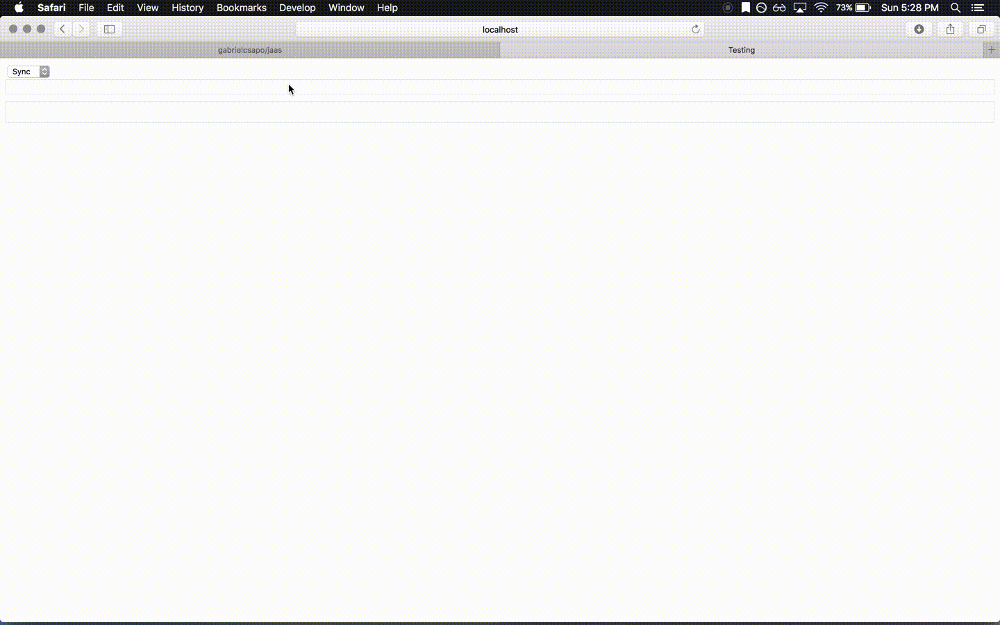

# jaas

> Javascript as a Service

## installation

```
npm install
```

## example

> localhost:3000/




## usage

```
/api/run
```

> examples

_synchronous_

```
curl -X POST localhost:3000/api/run --data "script=var moment=require('moment');moment().format('x');"
```

*result*

```
{
    "trace": [],
    "result": "'1460177101199'",
    "type": "String"
}
```

_async_

```
curl -X POST localhost:3000/api/run --data "script=var request = require('request-promise'); var response = await request({ url: 'https://graph.facebook.com/?id=http://news.ycombinator.com', json: true });&type=async"
```
*result*

```
{
    "trace": [],
    "result": {
        "id": "http://news.ycombinator.com",
        "shares": 9668,
        "comments": 3
    },
    "type": "Object"
}
```
